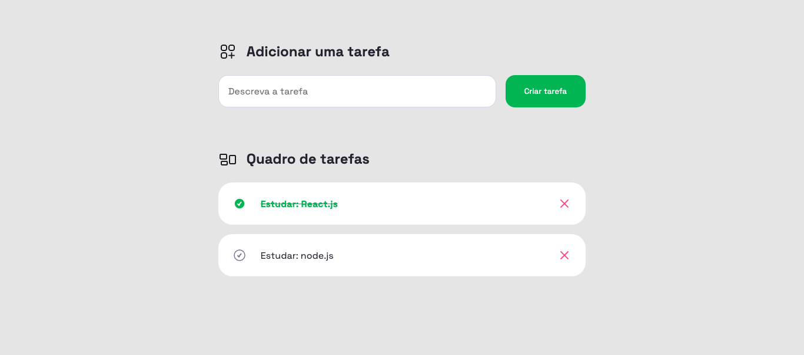

# To Do List com Javascript

O projeto teve o objetivo de consolidar o aprendizado de Javascript DOM ao criar um pequeno sistema que simula a adição de tarefas e dá a possibilidade do usuário "dar um check".

> [Clique aqui para ver a página na Web](https://matheusvaz-tech.github.io/toDoList/)

## Tecnologias implementadas

- HTML;
- CSS;
- Javascript e DOM;
- Git CLI.

## Contacts

